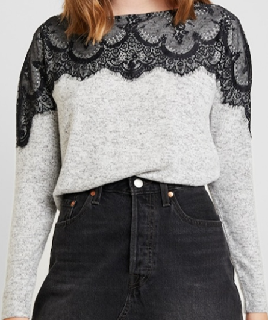

# Inference
- clone the repo `git clone https://github.com/vuongminh1907/Preprocess`.
- Install dependencies `pip install -r requirements.txt`
- Run `python process.py --image 'cloth.jpg' --position 'Upper body'` .
- Outputs will be saved in `output` folder

# Option for --position
- Upper body
- Lower body
- Full body

# Output samples
## Origin image

## Model wearing

## Cloth Only

